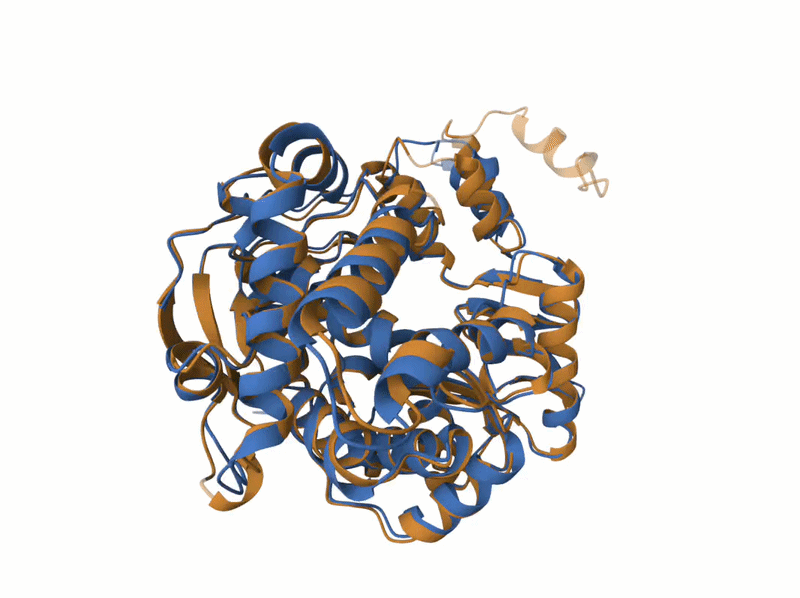

**affiliations**: Department of Plant Biology, Uppsala BioCenter, Swedish University of Agricultural Sciences and Linnean Center for Plant Biology, Box 7080, 75007 Uppsala, Sweden.

\***correspondence**: anders.hafren@slu.se

# Comparative viral transcriptomic analysis

RNA-seq expression data for uninfected and infected Arabidopsis thaliana were obtained from NCBI Bioprojects: TuMV PRJNA788379 @gyula2022ecotype,  TuYV and CaMV PRJEB49403 @chesnais2022comparative,  TyMV PRJNA1103879 @clavel2024metabolic, TCV PRJNA336058 @wu2016analyses, CMV PRJNA1124548 @liu2025mutually and ArLV1 PRJNA863409 @jiang2024deciphering. Read processing, alignment, and gene-level quantification was addressed by mapping with HISAT2 v2.2.1 (Kim et al., 2019) to TAIR10 reference genome and quantifying with featureCounts (Liao et al., 2014). Differential expression was computed separately within each using DESeq2 DEGs were calculated using Deseq2 (Love et al., 2014).

# Viral RdRps structural prediction and phylogenetics

Protein sequences corresponding to CMV 2a, TRV 134K, TyMV 206K, TRoV P2ab, ALV1 P1, TuMV NIb, and PLrV, TuYV, RYMV, AhPV1, TMV, YoMV, TCV, P1AMV RdRps were curated prior to structure prediction. For viruses where the replication protein is polyprotein-derived (e.g., TRoV P2ab), sequences were processed to extract the annotated mature peptide corresponding to the RdRP-containing product, final sequences are available in this repository. Each curated protein was then folded using AlphaFold2 (Jumper et al., 2021), while CaMV P5 PBD was the only RdRp experimentally elucidated (PDB: 8R0S) [@prabaharan2024structural]. To build a structure-based phylogeny, an initial structural reconstruction was performed using the predicted RdRP models, and a non-LTR retrotransposon reverse transcriptase structure (PDB: 8GH6) was included as an outgroup, in a similar way to Wolf et al. (2018). Finally, a consensus topology was obtained by performing an agreement analysis between trees generated from DALI (Holm, 2022) and Foldtree (Moi et al., 2025) outputs, retaining and scoring clades supported by both approaches.

## PDB sequence post-processing

The sequence or chain selection applied to each structure in `RdRps/` is summarized below. The repository contains the final PDB files but no separate processing manifest; therefore, this table reports the post-processing recoverable from filenames and coordinate records and does not infer unrecorded substitutions. Residue ranges follow the numbering stored in each PDB file. "Residues in PDB" counts residues with `ATOM` records; consequently, experimentally determined structures can contain fewer coordinate-bearing residues than the retained sequence span because unresolved residues are absent. Mean pLDDT was recalculated for AlphaFold2 models as the arithmetic mean of the C$\alpha$-atom B-factor field, using one value per residue. For experimental structures, this field contains experimental B-factors or related quality values rather than pLDDT and is therefore reported as not applicable (N/A).

| PDB file | Protein or construct | Sequence post-processing | Retained PDB range | Residues in PDB | Mean pLDDT | Published-structure citation |
|:--|:--|:--|:--:|--:|--:|:--|
| `ahpv1_rdrp_relax_m3_p0_plddt-90.pdb` | AhPV1 RdRp | Complete submitted RdRp sequence retained; no terminal trimming | A:1--585 | 585 | 90.61 | -- |
| `alv1_p1_1140_1610.pdb` | ALV1 P1 | N-terminal region removed to retain the C-terminal RdRp region; the stored endpoint is residue 1610 | A:1140--1610 | 471 | 87.78 | -- |
| `CaMV_P5_8R0S.pdb` | CaMV P5 reverse transcriptase | Protein chain A retained from the experimental structure; bound nucleic-acid chains were removed | A:1--475 | 470 | N/A | @prabaharan2024structural |
| `CMV_2a_273-750.pdb` | CMV 2a | Internal RdRp-containing region extracted from the replication protein | A:273--750 | 478 | 88.20 | -- |
| `HIV1RT_3DLK.pdb` | HIV-1 reverse transcriptase | Protein chain B retained from the experimental structure | B:6--428 | 409 | N/A | @bauman2008crystal |
| `nonLTR_RT_8gh6_1_924.pdb` | *Bombyx mori* R2 non-LTR reverse transcriptase | Protein chain A retained from the experimental structure; bound RNA and DNA chains were removed | A:111--924 | 715 | N/A | @wilkinson2023structure |
| `PlAMV_RdRp_q07518_895_1385.pdb` | PlAMV RdRp | C-terminal RdRp-containing region extracted from the replication protein | A:895--1385 | 491 | 85.61 | -- |
| `PLrV_Polerovirus_P11623_relax_m4_p0_plddt-78.pdb` | PLrV replication protein | Complete submitted replication-protein sequence retained; no terminal trimming | A:1--1062 | 1062 | 77.77 | -- |
| `rymv_rdrp_1_464.pdb` | RYMV RdRp | Complete submitted RdRp sequence retained; no terminal trimming | A:1--464 | 464 | 93.93 | -- |
| `tcv_rdrp_relax_m1_p0_plddt-92.pdb` | TCV RdRp | Complete submitted RdRp sequence retained; no terminal trimming | A:1--524 | 524 | 92.56 | -- |
| `tmv_rdrp_1117_relax_m3_p0_plddt-91.pdb` | TMV RdRp | C-terminal RdRp region beginning at source residue 1117 extracted and renumbered from 1 in the PDB | A:1--499 | 499 | 91.20 | -- |
| `trov_p2ab_428.pdb` | TRoV P2ab | N-terminal region removed to retain the mature RdRp-containing product | A:428--874 | 447 | 91.61 | -- |
| `trv_134k_1206_1707.pdb` | TRV 134K | C-terminal RdRp-containing region extracted | A:1206--1707 | 502 | 86.51 | -- |
| `TuMV_NIb_m2_plddt-93.pdb` | TuMV NIb | Mature NIb product extracted from the viral polyprotein and renumbered from 1 | A:1--517 | 517 | 93.20 | -- |
| `TuYV_RdRP_p09507_relax_m1_p0_plddt-80.pdb` | TuYV replication protein | Complete submitted replication-protein sequence retained; no terminal trimming | A:1--1035 | 1035 | 80.63 | -- |
| `tymv_206k_1298.pdb` | TyMV 206K | N-terminal region removed to retain the C-terminal RdRp-containing region | A:1298--1844 | 547 | 82.12 | -- |
| `YoMV_RdRP_q66220_1120_1597.pdb` | YoMV RdRp | C-terminal RdRp-containing region extracted from the replication protein | A:1120--1597 | 478 | 88.25 | -- |

## TRov vs RYMV RdRp TM-align

Graphical example of the structural alignment of RdRp between the close relative Sobemovirus TRoV (Blue) and RYMV (Orange) using [TM-Align algotihm](https://www.rcsb.org/alignment) from RCSB web tool: 

| Entry | Chain | RMSD | TM-score | Identity | Aligned Residues | Sequence Length | Modeled Residues |
|---|---|---:|---:|---:|---:|---:|---:|
| rymv_rdrp_1_464.pdb | A | - | - | - | - | 464 | 464 |
| trov_p2ab_428.pdb | A | 1.32 | 0.94 | 52% | 440 | 447 | 447 |

::: {style="text-align: center;"}
<figure>
```{=html}

```
<figcaption style="margin-top: 10px;">

<strong>structural alignment of RdRp between the close relative Sobemovirus TRoV (Blue) and RYMV (Orange)</strong>
</figcaption>
</figure>
<a name="RYMV_TRoV_RdRps.gif"></a>
:::


# References
