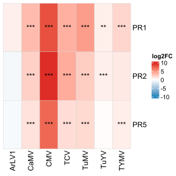
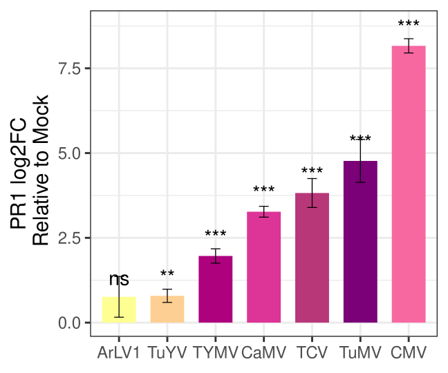
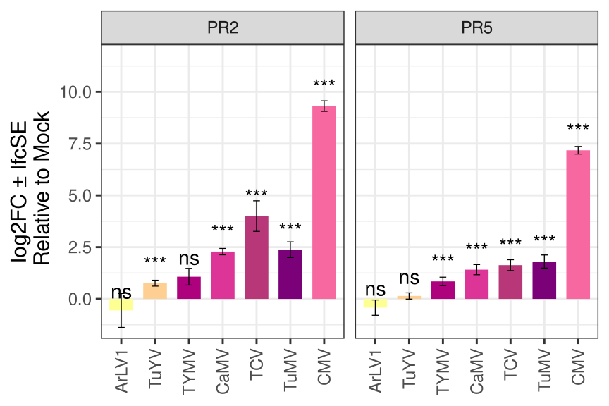
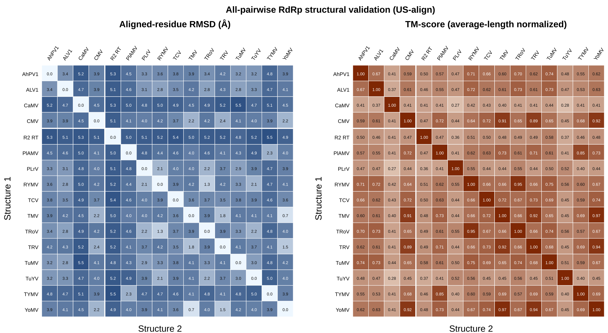
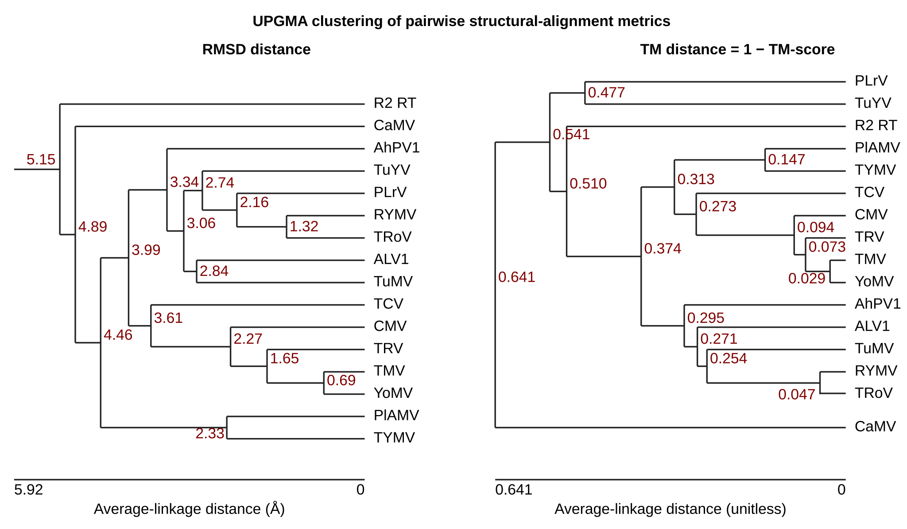
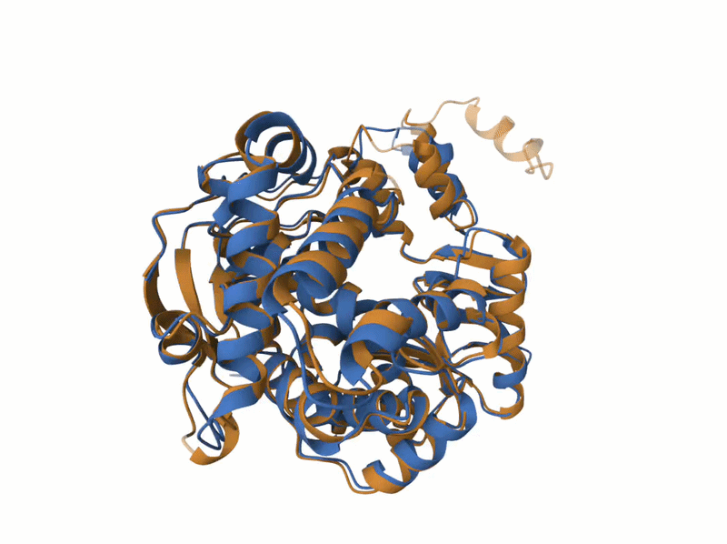

RNA silencing safeguards plant fertility during viral infection and
decreases Turnip rosette virus vertical transmission
================
Aimer Gutiérrez-Díaz, Sanjana Holla, Inês Moura and Anders Hafrén\*

**affiliations**: Department of Plant Biology, Uppsala BioCenter,
Swedish University of Agricultural Sciences and Linnean Center for Plant
Biology, Box 7080, 75007 Uppsala, Sweden.

\***correspondence**: <anders.hafren@slu.se>

# Comparative viral transcriptomic analysis

RNA-seq expression data for uninfected and infected Arabidopsis thaliana
were obtained from NCBI Bioprojects: TuMV PRJNA788379
\[[1](#ref-gyula2022ecotype)\], TuYV and CaMV PRJEB49403
\[[2](#ref-chesnais2022comparative)\], TYMV PRJNA1103879
\[[3](#ref-clavel2026selective)\], TCV PRJNA336058
\[[4](#ref-wu2016analyses)\], CMV PRJNA1124548
\[[5](#ref-liu2025mutually)\] and ArLV1 PRJNA863409
\[[6](#ref-jiang2024deciphering)\]. Read processing, alignment, and
gene-level quantification was addressed by mapping with HISAT2 v2.2.1
\[[7](#ref-kim2019graph)\] to TAIR10 reference genome and quantifying
with featureCounts \[[8](#ref-liao2014featurecounts)\]. Differential
expression was computed separately within each using DESeq2 DEGs were
calculated using Deseq2 \[[9](#ref-love2014moderated)\].

## Libraries re-mapped

| Virus |   Project    | Libraries |  SeqType   | Tissue  |     Ecotype     |      Genotypes      |          dpi          |                                                  SRRs                                                  |                                                    Paper                                                     |               Reference               |
|:-----:|:------------:|:---------:|:----------:|:-------:|:---------------:|:-------------------:|:---------------------:|:------------------------------------------------------------------------------------------------------:|:------------------------------------------------------------------------------------------------------------:|:-------------------------------------:|
| CaMV  |  PRJEB49403  |     6     | Paired-End | Rosette |      Col-0      |     WT aphid Mp     |     14dold, 21dpi     |                 ERR7738945, ERR7738946, ERR7738947, ERR7738939, ERR7738940, ERR7738941                 |                                          10.1128/spectrum.00136-22                                           | \[[2](#ref-chesnais2022comparative)\] |
| TuYV  |  PRJEB49403  |     3     | Paired-End | Rosette |      Col-0      |     WT aphid Mp     |     14dold, 21dpi     |                 ERR7738939, ERR7738940, ERR7738941, ERR7738942, ERR7738943, ERR7738944                 |                                          10.1128/spectrum.00136-22                                           | \[[2](#ref-chesnais2022comparative)\] |
| TuMV  | PRJNA788379  |     8     | Paired-End | Rosette | Col-0 and Bar-0 |         Wt          |     28dold, 14dpi     | SRR17227570, SRR17227569, SRR17227568, SRR17227567, SRR17227565, SRR17227564, SRR17227563, SRR17227562 |                                         10.1371/journal.pone.0275588                                         |    \[[1](#ref-gyula2022ecotype)\]     |
|  TCV  | PRJNA336058  |  6 (12)   | Paired-End | Leaves  |      Col-       |   WT and dcl1-/-    |     28dold, 8dpi      |                 SRR3992506, SRR3992507, SRR3992508, SRR3992509, SRR3992510, SRR3992511                 |                                              10.1038/srep36007.                                              |     \[[4](#ref-wu2016analyses)\]      |
|  CMV  | PRJNA1124548 |     6     | Paired-End | Rosette |      Col-0      | WT, CMV and CMV-Δ2b |         14dpi         |                           SRR29428980, SRR29428985, SRR29428982, SRR29428983                           |            [10.1038/s41467-025-65355-1](https://www.nature.com/articles/s41467-025-65355-1#Abs1)             |     \[[5](#ref-liu2025mutually)\]     |
| TYMV  | PRJNA1103879 |  8 (16)   | Single-End | Rosette |      Col-0      |     WT and atg2     |         12dpi         |                    SRR28785882, SRR28785883, SRR28785876, SRR28785877, SRR28785878                     |                    [10.1101/2024.05.06.590709](https://doi.org/10.1101/2024.05.06.590709)                    |   \[[3](#ref-clavel2026selective)\]   |
| ArLV1 | PRJNA863409  |  7 (58)   | Paired-End | Leaves  |      Col-0      |         WT          | 4% vs 80% infestation |              SRR20705605, SRR20705604, SRR20705602, SRR20705607, SRR20705606, SRR20705603              | [10.1093/plphys/kiae581](https://academic.oup.com/plphys/advance-article/doi/10.1093/plphys/kiae581/7849673) |  \[[6](#ref-jiang2024deciphering)\]   |

## From FeatureCouns

``` bash
 Rscript Code/deseqDEG.R FeatureCounts/Liu_CMV_fcounts.txt "WTvsWT" "CMVvsMock"

 Rscript Code/deseqDEG.R FeatureCounts/Gyula_TVCV_TuMV_fcounts.txt "WTvsWT" "TuMVvsMock"

 Rscript Code/deseqDEG.R FeatureCounts/Gao_TCV_fcounts.txt  "WTvsWT" "TCVvsMock"
 
 Rscript Code/deseqDEG.R FeatureCounts/Chesnais_CaMV_TuYV_fcounts.txt  "WTvsWT" "CaMVvsMock"
 
 Rscript Code/deseqDEG.R FeatureCounts/Chesnais_CaMV_TuYV_fcounts.txt  "WTvsWT" "TuYVvsMock"
 
 Rscript Code/deseqDEG.R FeatureCounts/Clavel_TYMV_fcounts.txt  "WTvsWT" "TYMVvsMock"
 
 Rscript Code/deseqDEG.R FeatureCounts/Jiang_ArLV1_mArR1fcounts.txt "WTvsWT" "ArLV1vsMock"
```

## Gene selection

``` bash
(cat Data/deseq_head.txt && for gene in `cat Data/PRs_genes.csv | cut -f 1` ; do grep $gene FeatureCounts/*DESeq2*; done  )  > Data/PRs_Deseq2.txt
```

## PRs genes expression

<div style="text-align: center;">

<figure>

<figcaption style="margin-top: 10px;">
<strong>Heatmap PRs related genes transcriptionally induce/repress by 7
different viruses</strong>
</figcaption>
</figure>

<a name="CompTranscriptome_PRs_sig.svg"></a>

</div>

``` r
DeseqOut <- read.delim("Data/PRs_Deseq2.txt", check.names = FALSE)
GeneNames <-  read.delim("Data/PRs_genes.csv", header = F)

colnames(GeneNames) <- c("gene","gene_name")

DeseqOut_clean <- DeseqOut %>%
  mutate(id = .[[1]]) %>%         
  select(-1) %>%
  separate(id, into = c("file", "gene"), sep = ":", extra = "merge", fill = "right") %>%
  mutate(
    file = basename(file),
    file = str_remove(file, "\\.tsv$"),
    Project = str_extract(file, "^[^_]+"),
    Condition =  gsub(".*_","",file),  
    Virus = str_match(file, "DESeq2_([^_]+)_vs_")[,2],
    sig = case_when(
      !is.na(padj) & padj < 0.001 ~ "***",
      !is.na(padj) & padj < 0.01  ~ "**",
      !is.na(padj) & padj < 0.05  ~ "*",
      TRUE ~ "ns"
    )
  )

DeseqOut_clean <- merge(GeneNames,DeseqOut_clean, by.x = "gene" )
```

### Heatmap from Deseq2

``` r
DeseqOut_clean$ColKey <- DeseqOut_clean$Virus

log2fc_mat <- xtabs(log2FoldChange ~ gene_name + ColKey, data = DeseqOut_clean)
log2fc_mat <- as.matrix(log2fc_mat)

# helper for significance stars: take first non-empty star, else ""
first_star <- function(x) {
  x <- x[!is.na(x)]
  x <- x[x != ""]
  x <- x[!x %in% c("ns","NS","n.s.","N.S.","NA")]
  if (length(x) == 0) return("")
  x[1]
}


sig_mat <- tapply(DeseqOut_clean$sig,
                  list(DeseqOut_clean$gene_name, DeseqOut_clean$ColKey),
                  first_star)


# ---- colors for unscaled log2FC ----
mx <- max(abs(log2fc_mat), na.rm = TRUE)
col_fun <- colorRamp2(c(-mx, 0, mx), c("#2b8cbe", "white", "#de2d26"))
# ---- draw heatmap with stars overlaid on cells ----

colOrder <- c( "ArLV1","TuYV","TYMV","CaMV","TCV","TuMV","CMV")

sig_mat <- sig_mat[rowOrder,]

ht <- Heatmap(
  log2fc_mat,
  name = "log2FC",
  col = col_fun,
  na_col = "grey90",
  cluster_rows = F,
  cluster_columns = F,
  column_title = NULL, 
  row_title = NULL, 
  rect_gp = gpar(col = "grey80", lwd = 0.5),
  #  stars on top of each cell
  cell_fun = function(j, i, x, y, w, h, fill) {
    s <- sig_mat[i, j]
    if (!is.na(s) && nzchar(s)) {
      grid.text(s, x, y, gp = gpar(fontsize = 12, col = "black"))
    }
  }
)

svg(filename = "Figures/CompTranscriptome_PRs_sig.svg",   width = 4, height = 4)
ht
dev.off()

pdf(file = "Figures/CompTranscriptome_PRs_sig.pdf",   width = 4, height = 4)
ht
dev.off()
```

## Single gene bar plot

<div style="text-align: center;">

<figure>

<figcaption style="margin-top: 10px;">
<strong> PR1 expression log2FC ± lfcSErelative to Mock in 7 different
viruses</strong>
</figcaption>
</figure>

<a name="PR1_plot.svg"></a>

</div>

``` r
DeseqOut_clean$Virus <- factor(DeseqOut_clean$Virus, levels = c("ArLV1","TuYV","TYMV","CaMV","TCV","TuMV","CMV"))

viral_gradient <-  c("Mock" ="#FA9EB4","TuYV" = "#fecf92","ArLV1" = "#feff92","TRoV" = "#641a80","CMV" = "#F768A1" ,"CaMV" ="#DD3497", "TYMV" = "#AE017E" ,"TCV" ="#b73779" ,"TuMV" = "#7A0177" )

PR1_plot <- ggplot(DeseqOut_clean[DeseqOut_clean$gene == "AT2G14610",], aes(x = Virus, y = log2FoldChange, fill = Virus)) +
  geom_col(width = 0.7) +
  geom_errorbar(aes(ymin = log2FoldChange - lfcSE, ymax = log2FoldChange + lfcSE),
                width = 0.2, linewidth = 0.6) +
  geom_text(aes(label = sig), position = position_dodge(width = 0.6),
            vjust = -0.8, size = 10, show.legend = FALSE) +
 scale_fill_manual(values = viral_gradient) +
    scale_y_continuous(expand = expansion(mult = c(0.05, 0.10))) +
#  facet_wrap(~ gene, scales = "free_y") +
  theme_bw( base_size = 30, base_family = "Helvetica")  +theme( legend.position = "none") +
  labs(x = NULL, y = "PR1 log2FC\n Relative to Mock")  

ggsave(PR1_plot, device = pdf, filename = "Figures/PR1_plot.pdf",  width=9, height=7.5)

PRs <- DeseqOut_clean[grepl( "AT2G14610|AT3G57260|AT1G75040", DeseqOut_clean$gene),-9]

out_list <- list(
  Deseq2Transcriptome = PRs
) 

ggsave(PR1_plot, device = svg, filename = "Figures/PR1_plot.svg",  width=9, height=7.5)
ggsave(PR1_plot, device = pdf, filename = "Figures/PR1_plot.pdf", width=9, height=7.5)


write.xlsx(out_list, file = "Results/SupTable5.PRs_comp_transcriptomics.xlsx", overwrite = TRUE)

PRs_plot <- ggplot(DeseqOut_clean[grepl( "AT3G57260|AT1G75040",DeseqOut_clean$gene ),], 
                   aes(x = Virus, y = log2FoldChange, fill = Virus)) +
  geom_col(width = 0.7) +
  geom_errorbar(aes(ymin = log2FoldChange - lfcSE, ymax = log2FoldChange + lfcSE),
                width = 0.2, linewidth = 0.6) +
  geom_text(aes(label = sig), position = position_dodge(width = 0.6),
            vjust = -0.8, size = 10, show.legend = FALSE) +
  scale_fill_manual(values = viral_gradient) +
    scale_y_continuous(expand = expansion(mult = c(0.05, 0.25))) +
 facet_grid(.~gene_name ) +
  theme_bw( base_size = 30, base_family = "Helvetica") + 
  labs(x = NULL, y = "log2FC ± lfcSE\n Relative to Mock")  +
theme(axis.text.x = element_text(angle = 90, vjust = 0.5, hjust = 1),legend.position = "none") 

ggsave(PRs_plot, device = pdf, filename = "Figures/PR2_5_plot.pdf",  width=12, height=8)
ggsave(PRs_plot, device = svg, filename = "Figures/PR2_5_plot.svg",  width=12, height=8)
```

<div style="text-align: center;">

<figure>

<figcaption style="margin-top: 10px;">
<strong> PR2 and PR5 expression log2FC ± lfcSErelative to Mock in 7
different viruses</strong>
</figcaption>
</figure>

<a name="PR2_5_plot.svg"></a>

</div>

# Viral RdRps structural prediction and phylogenetics

Protein sequences corresponding to CMV 2a, TRV 134K, TyMV 206K, TRoV
P2ab, ALV1 P1, TuMV NIb, and PLrV, TuYV, RYMV, AhPV1, TMV, YoMV, TCV,
P1AMV RdRps were curated prior to structure prediction. For viruses
where the replication protein is polyprotein-derived (e.g., TRoV P2ab),
sequences were processed to extract the annotated mature peptide
corresponding to the RdRP-containing product, final sequences are
available in this repository. Each curated protein was then folded using
AlphaFold2 \[[10](#ref-jumper2021highly)\], while CaMV P5 PBD was the
only RdRp experimentally elucidated (PDB: 8R0S)
\[[11](#ref-prabaharan2024structural)\]. To build a structure-based
phylogeny, an initial structural reconstruction was performed using the
predicted RdRP models, and a non-LTR retrotransposon reverse
transcriptase structure (PDB: 8GH6) was included as an outgroup, in a
similar way to \[[12](#ref-wolf2018origins)\]. Finally, a consensus
topology was obtained by performing an agreement analysis between trees
generated from DALI \[[13](#ref-holm2022dali)\] and Foldtree
\[[14](#ref-moi2025structural)\] outputs, retaining and scoring clades
supported by both approaches.

## PDB sequence post-processing

The sequence or chain selection applied to each structure in `RdRps/` is
summarized below. The repository contains the final PDB files but no
separate processing manifest; therefore, this table reports the
post-processing recoverable from filenames and coordinate records and
does not infer unrecorded substitutions. Residue ranges follow the
numbering stored in each PDB file. “Residues in PDB” counts residues
with `ATOM` records; consequently, experimentally determined structures
can contain fewer coordinate-bearing residues than the retained sequence
span because unresolved residues are absent. Mean pLDDT was recalculated
for AlphaFold2 models as the arithmetic mean of the C$\alpha$-atom
B-factor field, using one value per residue. For experimental
structures, this field contains experimental B-factors or related
quality values rather than pLDDT and is therefore reported as not
applicable (N/A).

| PDB file                                           | Protein or construct                           | Sequence post-processing                                                                            | Retained PDB range | Residues in PDB | Mean pLDDT | Published-structure citation            |
|:---------------------------------------------------|:-----------------------------------------------|:----------------------------------------------------------------------------------------------------|:------------------:|----------------:|-----------:|:----------------------------------------|
| `ahpv1_rdrp_relax_m3_p0_plddt-90.pdb`              | AhPV1 RdRp                                     | Complete submitted RdRp sequence retained; no terminal trimming                                     |      A:1–585       |             585 |      90.61 | –                                       |
| `alv1_p1_1140_1610.pdb`                            | ALV1 P1                                        | N-terminal region removed to retain the C-terminal RdRp region; the stored endpoint is residue 1610 |    A:1140–1610     |             471 |      87.78 | –                                       |
| `CaMV_P5_8R0S.pdb`                                 | CaMV P5 reverse transcriptase                  | Protein chain A retained from the experimental structure; bound nucleic-acid chains were removed    |      A:1–475       |             470 |        N/A | \[[11](#ref-prabaharan2024structural)\] |
| `CMV_2a_273-750.pdb`                               | CMV 2a                                         | Internal RdRp-containing region extracted from the replication protein                              |     A:273–750      |             478 |      88.20 | –                                       |
| `HIV1RT_3DLK.pdb`                                  | HIV-1 reverse transcriptase                    | Protein chain B retained from the experimental structure                                            |      B:6–428       |             409 |        N/A | \[[15](#ref-bauman2008crystal)\]        |
| `nonLTR_RT_8gh6_1_924.pdb`                         | *Bombyx mori* R2 non-LTR reverse transcriptase | Protein chain A retained from the experimental structure; bound RNA and DNA chains were removed     |     A:111–924      |             715 |        N/A | \[[16](#ref-wilkinson2023structure)\]   |
| `PlAMV_RdRp_q07518_895_1385.pdb`                   | PlAMV RdRp                                     | C-terminal RdRp-containing region extracted from the replication protein                            |     A:895–1385     |             491 |      85.61 | –                                       |
| `PLrV_Polerovirus_P11623_relax_m4_p0_plddt-78.pdb` | PLrV replication protein                       | Complete submitted replication-protein sequence retained; no terminal trimming                      |      A:1–1062      |            1062 |      77.77 | –                                       |
| `rymv_rdrp_1_464.pdb`                              | RYMV RdRp                                      | Complete submitted RdRp sequence retained; no terminal trimming                                     |      A:1–464       |             464 |      93.93 | –                                       |
| `tcv_rdrp_relax_m1_p0_plddt-92.pdb`                | TCV RdRp                                       | Complete submitted RdRp sequence retained; no terminal trimming                                     |      A:1–524       |             524 |      92.56 | –                                       |
| `tmv_rdrp_1117_relax_m3_p0_plddt-91.pdb`           | TMV RdRp                                       | C-terminal RdRp region beginning at source residue 1117 extracted and renumbered from 1 in the PDB  |      A:1–499       |             499 |      91.20 | –                                       |
| `trov_p2ab_428.pdb`                                | TRoV P2ab                                      | N-terminal region removed to retain the mature RdRp-containing product                              |     A:428–874      |             447 |      91.61 | –                                       |
| `trv_134k_1206_1707.pdb`                           | TRV 134K                                       | C-terminal RdRp-containing region extracted                                                         |    A:1206–1707     |             502 |      86.51 | –                                       |
| `TuMV_NIb_m2_plddt-93.pdb`                         | TuMV NIb                                       | Mature NIb product extracted from the viral polyprotein and renumbered from 1                       |      A:1–517       |             517 |      93.20 | –                                       |
| `TuYV_RdRP_p09507_relax_m1_p0_plddt-80.pdb`        | TuYV replication protein                       | Complete submitted replication-protein sequence retained; no terminal trimming                      |      A:1–1035      |            1035 |      80.63 | –                                       |
| `tymv_206k_1298.pdb`                               | TyMV 206K                                      | N-terminal region removed to retain the C-terminal RdRp-containing region                           |    A:1298–1844     |             547 |      82.12 | –                                       |
| `YoMV_RdRP_q66220_1120_1597.pdb`                   | YoMV RdRp                                      | C-terminal RdRp-containing region extracted from the replication protein                            |    A:1120–1597     |             478 |      88.25 | –                                       |

## Pairwise structural-alignment confidence and UPGMA clustering

To provide quantitative support for the structure-based groupings
obtained with DALI and Foldtree, all 17 structures in `RdRps/` were
compared in an all-versus-all analysis with US-align v20260826
\[[17](#ref-zhang2022usalign)\]. US-align performs sequence-independent
monomeric structural alignment by maximizing TM-score. For every one of
the 136 unique pairs, the analysis reports the RMSD over residues
retained in the final structural alignment, aligned length, sequence
identity, coverage, and TM-scores normalized independently by the length
of each structure. Because length-specific TM-scores are directional,
the symmetric TM-score matrix below uses the score normalized by the
average length of the two structures (`-a T`); both directional scores
remain available in the tidy results file.

TM-score ranges from 0 to 1, and values of at least approximately 0.5
generally indicate the same global protein fold. RMSD is sensitive to
the number of aligned residues and was therefore interpreted jointly
with TM-score and alignment coverage. These metrics provide an
independent, quantitative check of the structural-similarity signal
underlying the DALI/Foldtree topology; they are descriptive alignment
measures rather than bootstrap or branch-support probabilities.

| Summary statistic                                              |                 Value |
|:---------------------------------------------------------------|----------------------:|
| Structures                                                     |                    17 |
| Unique pairwise alignments                                     |                   136 |
| RMSD, minimum / median / maximum                               |  0.69 / 4.16 / 6.60 Å |
| Average-length-normalized TM-score, minimum / median / maximum | 0.229 / 0.549 / 0.971 |
| Pairs with TM-score \>= 0.5                                    |        75/136 (55.1%) |

The closest structural pairs illustrate that the high-similarity signal
is not restricted to a single example. TMV–YoMV had the highest
average-length-normalized TM-score (0.971; RMSD 0.69 Å across 478
aligned residues), followed by RYMV–TRoV (0.953; 1.32 Å across 445
residues), TRV–YoMV (0.937; 1.52 Å across 475 residues), and CMV–YoMV
(0.921; 2.20 Å across 468 residues).

<figure>

<figcaption aria-hidden="true">All pairwise aligned-residue RMSD and
average-length-normalized TM-score values.</figcaption>
</figure>

The complete numerical results are available as a [tidy pairwise
table](Results/pairwise_structure_validation/pairwise_alignments.csv),
an [RMSD
matrix](Results/pairwise_structure_validation/pairwise_rmsd_matrix.csv),
and a [TM-score
matrix](Results/pairwise_structure_validation/pairwise_tm_score_matrix.csv).
The [run
metadata](Results/pairwise_structure_validation/run_metadata.json)
records the US-align version, executable checksum, command, and metric
definitions.

### UPGMA clustering of the pairwise metrics

UPGMA average-linkage clustering \[[18](#ref-sokal1958statistical)\] was
performed independently with (i) aligned-residue RMSD as the distance
and (ii) `1 -` average-length-normalized TM-score as the distance. The
internal-node labels in the dendrograms are the arithmetic-mean linkage
distances at which clusters were joined. Both analyses recover the
particularly close TMV–YoMV and RYMV–TRoV pairs; additional differences
between the dendrograms are expected because RMSD and TM-score weight
alignment extent and length differently. UPGMA imposes an ultrametric
hierarchy, so these dendrograms are a transparent descriptive clustering
of the validation metrics and are not presented as replacements for the
DALI/Foldtree evolutionary topology.

<figure>

<figcaption aria-hidden="true">UPGMA clustering calculated independently
from the RMSD and TM-distance matrices.</figcaption>
</figure>

The exact linkage histories are provided in the [RMSD merge
table](Results/pairwise_structure_validation/upgma_rmsd_merges.csv) and
[TM-distance merge
table](Results/pairwise_structure_validation/upgma_tm_distance_merges.csv).
Machine-readable trees are provided in Newick format for
[RMSD](Results/pairwise_structure_validation/upgma_rmsd.newick) and [TM
distance](Results/pairwise_structure_validation/upgma_tm_distance.newick).

The complete analysis, including all alignments, matrices, UPGMA trees,
and figures, can be regenerated with the repository script after
downloading the official [US-align
executable](https://seq2fun.dcmb.med.umich.edu/US-align/):

``` bash
python Code/pairwise_structure_validation.py --usalign /path/to/USalign
```

### Representative RYMV–TRoV alignment

The existing structural visualization shows the close Sobemovirus pair
TRoV (blue) and RYMV (orange). The values below were recalculated in the
same all-pairwise US-align run.

| Pair      | Chains | RMSD (Å) | TM-score (average-length normalized) | Directional TM-scores (RYMV / TRoV length) | Identity | Aligned residues |
|:----------|:------:|---------:|-------------------------------------:|-------------------------------------------:|---------:|-----------------:|
| RYMV–TRoV | A / A  |     1.32 |                                0.953 |                              0.936 / 0.971 |    51.5% |              445 |

<div style="text-align: center;">

<figure>

<figcaption style="margin-top: 10px;">
<strong>Structural alignment of RdRp between the closely related
Sobemoviruses TRoV (blue) and RYMV (orange).</strong>
</figcaption>
</figure>

<a name="RYMV_TRoV_RdRps.gif"></a>

</div>

# References

<div id="refs" class="references csl-bib-body">

<div id="ref-gyula2022ecotype" class="csl-entry">

1\. Gyula P, Tóth T, Gorcsa T, Nyikó T, Sós-Hegedűs A, Szittya G.
Ecotype-specific blockage of tasiARF production by two different RNA
viruses in arabidopsis. Plos one. 2022;17:e0275588.

</div>

<div id="ref-chesnais2022comparative" class="csl-entry">

2\. Chesnais Q, Golyaev V, Velt A, Rustenholz C, Brault V, Pooggin MM,
et al. Comparative plant transcriptome profiling of arabidopsis thaliana
col-0 and camelina sativa var. Celine infested with myzus persicae
aphids acquiring circulative and noncirculative viruses reveals
virus-and plant-specific alterations relevant to aphid feeding behavior
and transmission. Microbiology Spectrum. 2022;10:e00136–22.

</div>

<div id="ref-clavel2026selective" class="csl-entry">

3\. Clavel M, Bianchi A, Kobylinska R, Groh R, Zhang X, Ma J, et al.
Selective autophagy fine-tunes plant immunity to promote cell survival
during viral infection. Science. 2026;392:eadu9554.

</div>

<div id="ref-wu2016analyses" class="csl-entry">

4\. Wu C, Li X, Guo S, Wong S-M. Analyses of RNA-seq and sRNA-seq data
reveal a complex network of anti-viral defense in TCV-infected
arabidopsis thaliana. Scientific reports. 2016;6:36007.

</div>

<div id="ref-liu2025mutually" class="csl-entry">

5\. Liu J-H, Lin Y, Li Y-X, Lang Z, Zhang Z, Duan C-G. A mutually
antagonistic mechanism mediated by RNA m6A modification in plant-virus
interactions. Nature Communications. 2025;16:10378.

</div>

<div id="ref-jiang2024deciphering" class="csl-entry">

6\. Jiang Z, Verhoeven A, Li Y, Geertsma R, Sasidharan R, Zanten M van.
Deciphering acclimation to sublethal combined and sequential abiotic
stresses in arabidopsis thaliana. Plant Physiology. 2024;kiae581.

</div>

<div id="ref-kim2019graph" class="csl-entry">

7\. Kim D, Paggi JM, Park C, Bennett C, Salzberg SL. Graph-based genome
alignment and genotyping with HISAT2 and HISAT-genotype. Nature
biotechnology. 2019;37:907–15.

</div>

<div id="ref-liao2014featurecounts" class="csl-entry">

8\. Liao Y, Smyth GK, Shi W. featureCounts: An efficient general purpose
program for assigning sequence reads to genomic features.
Bioinformatics. 2014;30:923–30.

</div>

<div id="ref-love2014moderated" class="csl-entry">

9\. Love MI, Huber W, Anders S. Moderated estimation of fold change and
dispersion for RNA-seq data with DESeq2. Genome biology. 2014;15:550.

</div>

<div id="ref-jumper2021highly" class="csl-entry">

10\. Jumper J, Evans R, Pritzel A, Green T, Figurnov M, Ronneberger O,
et al. Highly accurate protein structure prediction with AlphaFold.
nature. 2021;596:583–9.

</div>

<div id="ref-prabaharan2024structural" class="csl-entry">

11\. Prabaharan C, Figiel M, Szczepanowski RH, Skowronek K, Zajko W,
Thangaraj V, et al. Structural and biochemical characterization of
cauliflower mosaic virus reverse transcriptase. Journal of Biological
Chemistry. 2024;300:107555. <https://doi.org/10.1016/j.jbc.2024.107555>.

</div>

<div id="ref-wolf2018origins" class="csl-entry">

12\. Wolf YI, Kazlauskas D, Iranzo J, Lucı́a-Sanz A, Kuhn JH, Krupovic M,
et al. Origins and evolution of the global RNA virome. MBio.
2018;9:10–1128.

</div>

<div id="ref-holm2022dali" class="csl-entry">

13\. Holm L. Dali server: Structural unification of protein families.
Nucleic acids research. 2022;50:W210–5.

</div>

<div id="ref-moi2025structural" class="csl-entry">

14\. Moi D, Bernard C, Steinegger M, Nevers Y, Langleib M, Dessimoz C.
Structural phylogenetics unravels the evolutionary diversification of
communication systems in gram-positive bacteria and their viruses.
Nature Structural & Molecular Biology. 2025;32:2492–502.

</div>

<div id="ref-bauman2008crystal" class="csl-entry">

15\. Bauman JD, Das K, Ho WC, Baweja M, Himmel DM, Clark AD Jr., et al.
Crystal engineering of HIV-1 reverse transcriptase for structure-based
drug design. Nucleic Acids Research. 2008;36:5083–92.
<https://doi.org/10.1093/nar/gkn464>.

</div>

<div id="ref-wilkinson2023structure" class="csl-entry">

16\. Wilkinson ME, Frangieh CJ, Macrae RK, Zhang F. Structure of the R2
non-LTR retrotransposon initiating target-primed reverse transcription.
Science. 2023;380:301–8. <https://doi.org/10.1126/science.adg7883>.

</div>

<div id="ref-zhang2022usalign" class="csl-entry">

17\. Zhang C, Shine M, Pyle AM, Zhang Y.
<span class="nocase">US-align</span>: Universal structure alignments of
proteins, nucleic acids, and macromolecular complexes. Nature Methods.
2022;19:1109–15. <https://doi.org/10.1038/s41592-022-01585-1>.

</div>

<div id="ref-sokal1958statistical" class="csl-entry">

18\. Sokal RR, Michener CD, et al. A statistical method for evaluating
systematic relationships. 1958.

</div>

</div>
